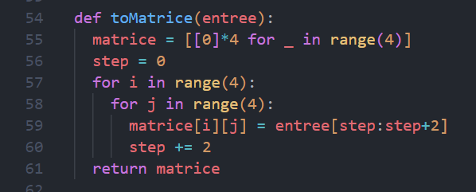

# Compte Rendu - Implémentation AES - Fabien Fleisch

# Sujet

Dans le cadre du cours de Sécurisation des échanges de données et des matériels nous avons vu l'encryptage symétreique AES, nous avons dans un premier temps réalisé cet encryptage à la main, en suivant des étapes indiqués dans un carnet de TD.  

Nous avons du réalisé cette encryption en Python par la suite afin de rendre l'encryption utilisable dans un projet réel  

Cette implémentation devait être réalisé en Python sans l'aide de library externe déjà existante.  

L'ensemble du code représente l'implémentation d'une ronde (round) de l'algorithme AES (Advanced Encryption Standard) pour une clé de 128 bits. Chaque étape vise à apporter de la confusion et de la diffusion des données pour renforcer la sécurité de l'algorithme face aux attaques.

# Etat de lieux initial

Nous avions déjà réalisé l'encryptage en cours et une version corrigée était à notre disposition ainsi que le standard AES décrivant les différentes étapes à suivre pour mettre en place l'encryption. Etant novice en python j'ai décidé de réalisé cette implémentation pas à pas et sans utilisé les fonctions et opérateur que je ne comprenais pas, qui sont trouvables dans les ressources sur internet.  

- **Voici le pseudo code suivi pour réalisé l'encryption :**

- **Et les différentes étapes suivi lors du TD :**
  

- **Les clés pour l'étape MixColumns issu du TD :**
  

- **Pour finir nous avions aussi la S-Box fournit :**  

  unsigned char s_box[256] = {
	0X63, 0X7C, 0X77, 0X7B, 0XF2, 0X6B, 0X6F, 0XC5, 0X30, 0X01, 0X67, 0X2B, 0XFE, 0XD7, 0XAB, 0X76,
	0XCA, 0X82, 0XC9, 0X7D, 0XFA, 0X59, 0X47, 0XF0, 0XAD, 0XD4, 0XA2, 0XAF, 0X9C, 0XA4, 0X72, 0XC0,
	0XB7, 0XFD, 0X93, 0X26, 0X36, 0X3F, 0XF7, 0XCC, 0X34, 0XA5, 0XE5, 0XF1, 0X71, 0XD8, 0X31, 0X15,
	0X04, 0XC7, 0X23, 0XC3, 0X18, 0X96, 0X05, 0X9A, 0X07, 0X12, 0X80, 0XE2, 0XEB, 0X27, 0XB2, 0X75,
	0X09, 0X83, 0X2C, 0X1A, 0X1B, 0X6E, 0X5A, 0XA0, 0X52, 0X3B, 0XD6, 0XB3, 0X29, 0XE3, 0X2F, 0X84,
	0X53, 0XD1, 0X00, 0XED, 0X20, 0XFC, 0XB1, 0X5B, 0X6A, 0XCB, 0XBE, 0X39, 0X4A, 0X4C, 0X58, 0XCF,
	0XD0, 0XEF, 0XAA, 0XFB, 0X43, 0X4D, 0X33, 0X85, 0X45, 0XF9, 0X02, 0X7F, 0X50, 0X3C, 0X9F, 0XA8,
	0X51, 0XA3, 0X40, 0X8F, 0X92, 0X9D, 0X38, 0XF5, 0XBC, 0XB6, 0XDA, 0X21, 0X10, 0XFF, 0XF3, 0XD2,
	0XCD, 0X0C, 0X13, 0XEC, 0X5F, 0X97, 0X44, 0X17, 0XC4, 0XA7, 0X7E, 0X3D, 0X64, 0X5D, 0X19, 0X73,
	0X60, 0X81, 0X4F, 0XDC, 0X22, 0X2A, 0X90, 0X88, 0X46, 0XEE, 0XB8, 0X14, 0XDE, 0X5E, 0X0B, 0XDB,
	0XE0, 0X32, 0X3A, 0X0A, 0X49, 0X06, 0X24, 0X5C, 0XC2, 0XD3, 0XAC, 0X62, 0X91, 0X95, 0XE4, 0X79,
	0XE7, 0XC8, 0X37, 0X6D, 0X8D, 0XD5, 0X4E, 0XA9, 0X6C, 0X56, 0XF4, 0XEA, 0X65, 0X7A, 0XAE, 0X08,
	0XBA, 0X78, 0X25, 0X2E, 0X1C, 0XA6, 0XB4, 0XC6, 0XE8, 0XDD, 0X74, 0X1F, 0X4B, 0XBD, 0X8B, 0X8A,
	0X70, 0X3E, 0XB5, 0X66, 0X48, 0X03, 0XF6, 0X0E, 0X61, 0X35, 0X57, 0XB9, 0X86, 0XC1, 0X1D, 0X9E,
	0XE1, 0XF8, 0X98, 0X11, 0X69, 0XD9, 0X8E, 0X94, 0X9B, 0X1E, 0X87, 0XE9, 0XCE, 0X55, 0X28, 0XDF,
	0X8C, 0XA1, 0X89, 0X0D, 0XBF, 0XE6, 0X42, 0X68, 0X41, 0X99, 0X2D, 0X0F, 0XB0, 0X54, 0XBB, 0X16 };

# Programmation de la solution

## 1. Initialisation  

  

Dans un premier temps j'ai modifié la S-Box donné dans le sujet dans un format  lisible par un code Python car celle donné dans le TD était destiné à un programme en C.  

**Voici donc le tableau adapté :**

s_box = [
    "63", "7C", "77", "7B", "F2", "6B", "6F", "C5", "30", "01", "67", "2B", "FE", "D7", "AB", "76",
    "CA", "82", "C9", "7D", "FA", "59", "47", "F0", "AD", "D4", "A2", "AF", "9C", "A4", "72", "C0",
    "B7", "FD", "93", "26", "36", "3F", "F7", "CC", "34", "A5", "E5", "F1", "71", "D8", "31", "15",
    "04", "C7", "23", "C3", "18", "96", "05", "9A", "07", "12", "80", "E2", "EB", "27", "B2", "75",
    "09", "83", "2C", "1A", "1B", "6E", "5A", "A0", "52", "3B", "D6", "B3", "29", "E3", "2F", "84",
    "53", "D1", "00", "ED", "20", "FC", "B1", "5B", "6A", "CB", "BE", "39", "4A", "4C", "58", "CF",
    "D0", "EF", "AA", "FB", "43", "4D", "33", "85", "45", "F9", "02", "7F", "50", "3C", "9F", "A8",
    "51", "A3", "40", "8F", "92", "9D", "38", "F5", "BC", "B6", "DA", "21", "10", "FF", "F3", "D2",
    "CD", "0C", "13", "EC", "5F", "97", "44", "17", "C4", "A7", "7E", "3D", "64", "5D", "19", "73",
    "60", "81", "4F", "DC", "22", "2A", "90", "88", "46", "EE", "B8", "14", "DE", "5E", "0B", "DB",
    "E0", "32", "3A", "0A", "49", "06", "24", "5C", "C2", "D3", "AC", "62", "91", "95", "E4", "79",
    "E7", "C8", "37", "6D", "8D", "D5", "4E", "A9", "6C", "56", "F4", "EA", "65", "7A", "AE", "08",
    "BA", "78", "25", "2E", "1C", "A6", "B4", "C6", "E8", "DD", "74", "1F", "4B", "BD", "8B", "8A",
    "70", "3E", "B5", "66", "48", "03", "F6", "0E", "61", "35", "57", "B9", "86", "C1", "1D", "9E",
    "E1", "F8", "98", "11", "69", "D9", "8E", "94", "9B", "1E", "87", "E9", "CE", "55", "28", "DF",
    "8C", "A1", "89", "0D", "BF", "E6", "42", "68", "41", "99", "2D", "0F", "B0", "54", "BB", "16"]  

J'ai aussi retranscrit la matrice pour le MixColumns dans le code, et je l'ai stockée dans la variable `mixColKey`.  

Enfin nous avons la donnée d'entrée en format hexadécimal dans la variable `input_str`.  

## 2. Fonction main du programme  

Je vous présente dans un premier temps la fonction qui va réalisé toute les opération sur la donnée d'entrée et nous afficher les résultats.  

**Déroulement du programme :**  

- Dans un premier temps je rend le string d'entrée en lower case afin de ne pas avoir de problème peu importe le format à l'entrée
- Puis je transforme le string en matrice grâce à la fonction `toMatrice(entree)`.  

  
Dans cette fonction je transforme le string en matrice afin de faciliter les opérations par la suite vu que l'on va travailler avec es donénes sous forme de matrice tout au long du programme.

- Ensuite on affiche dans un premier temps la matrice dans un format de matrice 4*4.
- Puis on réalise la fonction `subBytes()`.
- Puis `shiftRows()`.
- Et `mixColumns()`.

## 3. Fonction subBytes  

  
Dans cette fonction l'objectif est de substituer chaque octet du mot en entrée par un autre octet en fonction d'une table de correspondance qui est dans le code Python la `s_box`.  

**Exemple :**  
  
Voici la même table de substition que la `s_box` mais plus facilement lisible par un humain. C'est un tableau à 2 entrée qui permet de de faire coresspondre un octet à un autre. Par exemple si on a l'octet sous format hexadécimal : `A0` en entrée la sortie sera `E0`.

- Dans mon code j'ai ajouté la fonction `fromLetterToDec` qui permet de transformer les caractère hexadécimaux en format décimal -> donc `A` sera transformé en `10` par exemple.  
Cela me permet d'itérer facilement dans la `s_box` afin de substituer correctement les octets.

## 4. Fonction shiftRows  

Cette fonction à pour utilité de décaler à droite les différentes lignes de la matrice en fonction de la ligne traité.  
Donc la première ligne de la matrice ne sera pas décalé, la 2ème de 1, la 3ème de 2, et la 4ème de 3.

## 5. Fonction mixColumns  

Cette partie du code se découpe en 4 partie distinguable en 2 fonctions :  

Fonction principale :  

  

Fonction réalisant le multiplication des termes :  
 

1. Pour chaque colonne de l'état (`col`), la fonction effectue une multiplication matricielle avec la matrice `mixColKey`. Chaque élément de la nouvelle colonne résultante est calculé en effectuant une multiplication polynomiale de chaque élément de la colonne d'entrée (`input`) avec les éléments correspondants de la ligne de la matrice `mixColKey`, suivie d'une opération XOR pour combiner les résultats.

2. La fonction `multiply(a, b)` est utilisée pour effectuer la multiplication polynomiale dans le corps fini GF(2^8). Cela signifie que les calculs sont effectués sur des octets, et l'opération de multiplication est une multiplication polynomiale modulo un polynôme irréductible spécifique.

3. La fonction retourne une nouvelle matrice `output` représentant l'état après l'opération MixColumns.

4. La partie suivante convertit chaque élément de la matrice `output` en une représentation hexadécimale de deux caractères (`output_hex`). Cela est fait pour des raisons de présentation ou d'affichage.

# Affichage résultat
